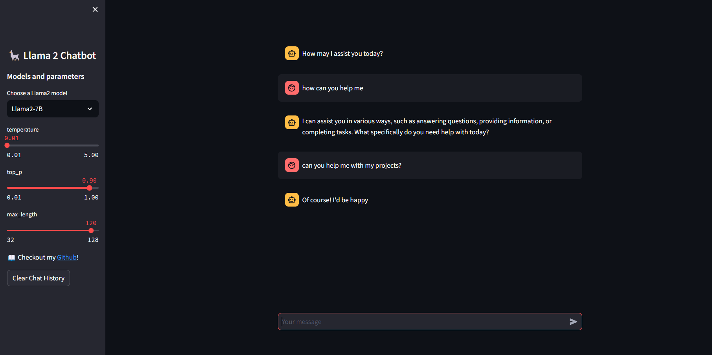

## Llama 2 Chatbot with Streamlit and Replicate

### Overview

This code implements a chatbot using the Llama 2 language model, powered by the Streamlit framework and Replicate API. The chatbot engages in conversations with users, responding to prompts in a natural language manner.

### Features

- **Model Selection:** Users can choose between different Llama 2 models, such as 'Llama2-7B' and 'Llama2-13B', each with its unique capabilities.

- **Parameter Adjustment:** The chatbot's behavior can be fine-tuned with parameters like temperature, top_p, and max_length, providing flexibility in generating responses.

- **Chat History Management:** Users can clear the chat history with a button, facilitating a clean conversation interface.

### Getting Started

1. **API Token:** Ensure that you have a Replicate API token, and set it in the Streamlit secrets for secure access.

2. **Model Selection:** Choose a Llama 2 model and set parameters in the sidebar.

3. **Interact:** Users can input prompts using the chat interface, and the chatbot generates responses dynamically.

### Dependencies

- [Streamlit](https://streamlit.io/)
- [Replicate API](https://replicate.ai/)

### WebApp Preview

